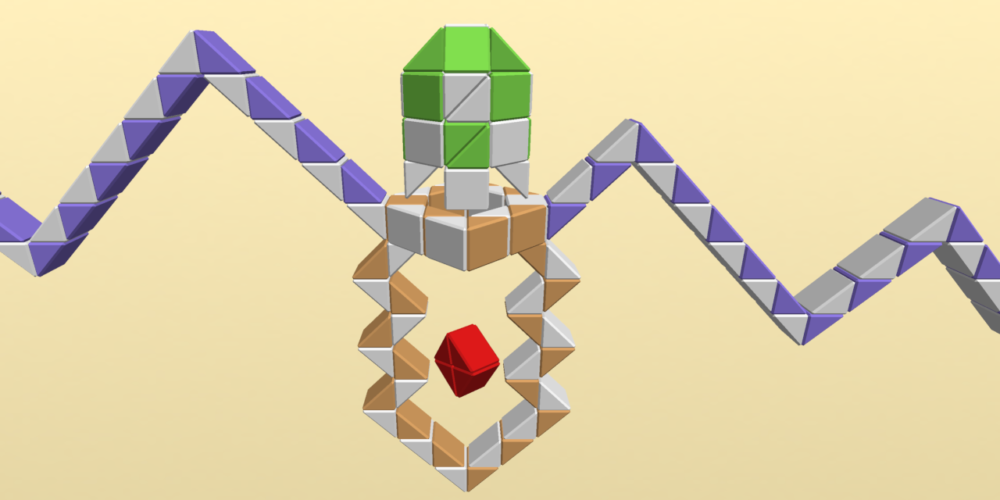

# Twisty Lander

## Description
Simple lander game made of right isosceles triangular prisms and with randomly generated mountains.

## How to Play
Hold the left or right button to take off and move to the side and the down button to dig.

Or touch the left or right side of the screen to fly and the middle part to dig.

## Run
[Open on GitHub Pages](https://iliagrigorevdev.github.io/twistylander/)

## Built With
[ammo.js](https://github.com/kripken/ammo.js), direct port of the [Bullet](https://github.com/bulletphysics/bullet3) physics engine to JavaScript using Emscripten.

[three.js](https://github.com/mrdoob/three.js), JavaScript 3D library.
